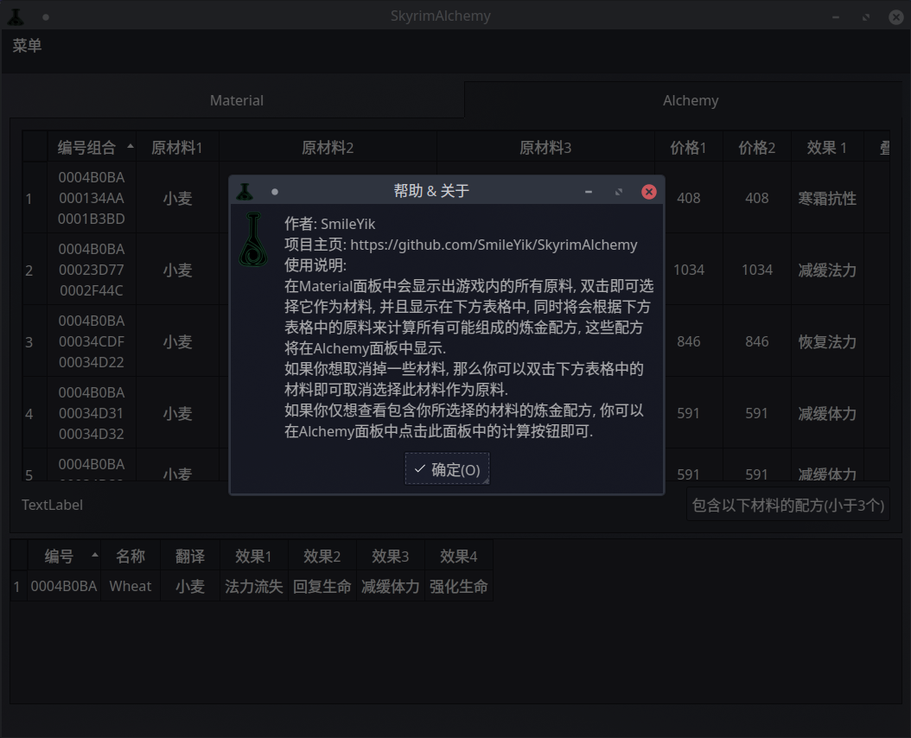
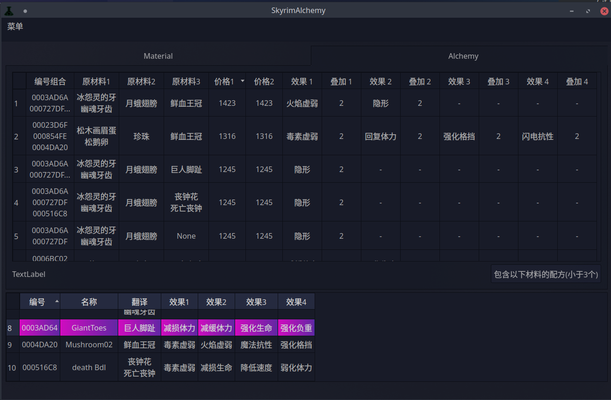
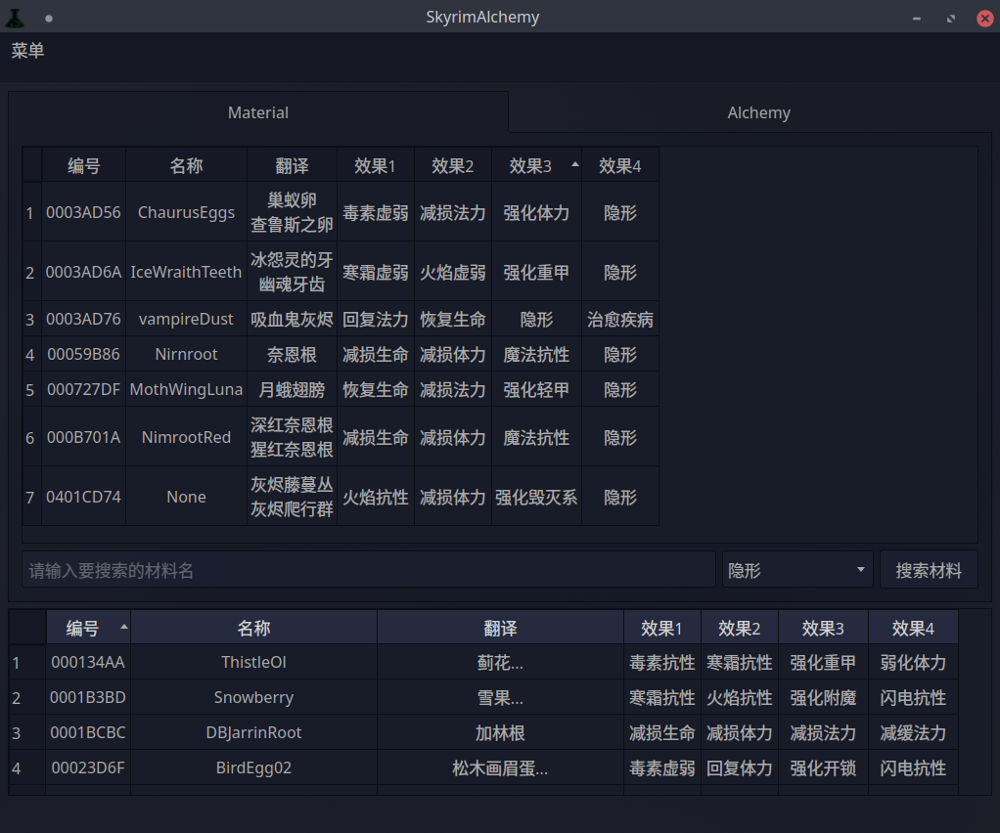

## SkyrimAlchemy

### how to build.

You need Qt5 and CMake 2.8.11 or higher

-- Build instructions --

``` shell
git clone https://github.com/SmileYik/SkyrimAlchemy.git
cd SkyrimAlchemy
mkdir build && cd build
cmake ../
make

./skyrimalchemy
```

-- Tutorials and resources --

Qt online docs
https://doc.qt.io/

### Modify the built-in alchemy materials and alchemy effects

Several resource files are stored in the `resources` folder, and the files that need to be modified are all in it.

#### alchemy_effect_price

This is a file that stores alchemy effects and their base prices, one alchemy effect per line.
The attributes of the alchemy effect are separated by ` ` (space).

```
effect_id effect_name base_price [+material_id new_base_iprice]
```

Among them, the content in `[]` can be added optionally, which means that the basic price of this effect becomes the new basic price after adding the material

#### alchemy_material

This is a file for storing alchemy materials, one alchemy material per line, and its properties are separated by ` ` (space)
open, followed by:

```
material_id effect_id1 effect_d2 effect_id3 effect_id4
```

Represents that this material has four effects

#### alchemy_material_en

The English name of the material is stored. In the content of each line, each attribute is separated by ` ` (space), in order:

```
material_id english_name
```

#### alchemy_material_tr

The translation name of the material is stored. In the content of each line, each attribute is separated by ` ` (space), in order:

```
material_id translation_name_1
```

There can be multiple translation names, all separated by spaces.

### 修改内置炼金材料与炼金效果

在`resources`文件夹中存放者若干资源文件, 需要修改的文件都在其中.

#### alchemy_effect_price

这个是存放炼金效果及其基础价格的文件, 每行一个炼金效果.
炼金效果的各项属性由` `(空格)分隔开. 依次为

```
效果id 效果名 基础价格 [+材料id 新基础价格]
```

其中`[]`内的内容可选添加, 代表添加了该材料此效果基础价格变为新基础价格

#### alchemy_material

这个是存放炼金材料的文件, 每行一个炼金材料, 它的各项属性由` `(空格)分隔
开, 依次为:

```
材料id 效果id1 效果id2 效果id3 效果id4
```

代表这个材料有四个效果

#### alchemy_material_en

存放着材料的英文名称, 每行的内容中, 各属性由` `(空格)分隔开, 依次为:

```
材料id 英文名
```

#### alchemy_material_tr

存放着材料的翻译名称, 每行的内容中, 各属性由` `(空格)分隔开, 依次为:

```
材料id 翻译名称1 ...
```

可以有多个翻译名称, 都由空格隔开.

### 展示




